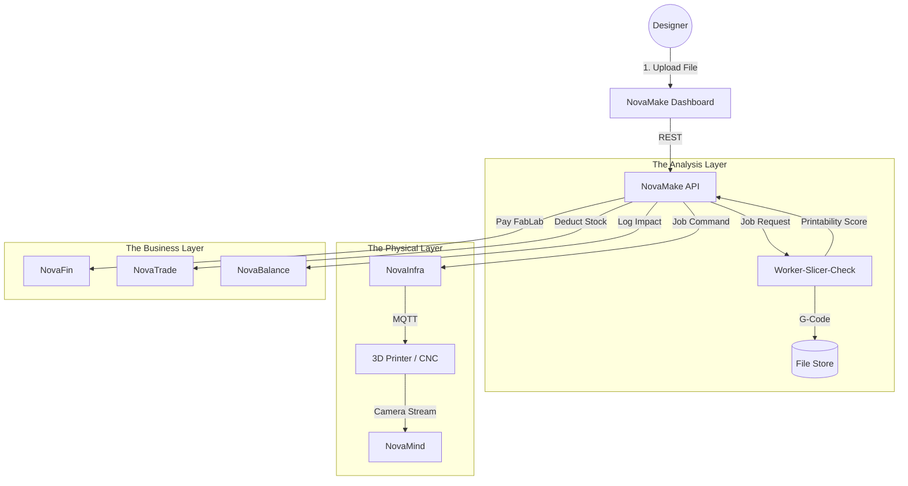

# 🏭 NovaMake

> **The Operating System for Distributed Manufacturing.**
> Orchestrating 3D printing farms, CNC networks, and FabLabs to enable local, on-demand production.

[](https://www.google.com/search?q=https://github.com/novaeco-tech/novamake/actions)
[](https://opensource.org/licenses/MIT)
[](https://www.google.com/search?q=https://make.novaeco.tech)

**NovaMake** is the Vertical Sector responsible for **Manufacturing**. Unlike `NovaBuild` (which constructs static buildings), NovaMake focuses on discrete, movable objects. It connects digital designs (STLs/CAD) with physical machines (Printers/Mills) to produce spare parts and products locally.

It is the engine behind the "Digital Warehouse"—eliminating physical inventory in favor of digital files that are manufactured only when needed.

-----

## 🎯 Value Proposition

Global supply chains are fragile and carbon-intensive. **NovaMake** democratizes production:

1.  **Logistics Reduction:** "Move Data, Not Atoms." A spare part is designed in Tokyo but printed in Berlin, eliminating air freight emissions.
2.  **Right to Repair:** Providing the infrastructure to manufacture discontinued spare parts on demand (supporting `NovaTronix` repair shops).
3.  **Material Efficiency:** Optimizing additive manufacturing paths to minimize waste, and using recycled feedstock from `NovaRecycle`.

-----

## 🏗️ Architecture (The Cloud Factory)

NovaMake acts as a Manufacturing Execution System (MES) for a decentralized grid of machines.



### Integrated Services

  * **[NovaInfra](https://www.google.com/search?q=https://infrastructure.novaeco.tech):** The driver layer. It speaks the low-level protocols (OctoPrint, Moonraker, G-code) to control the machines.
  * **[NovaMind](https://www.google.com/search?q=https://mind.novaeco.tech):** The quality inspector. Analyzes camera feeds during printing to detect failures ("Spaghetti detection") and pause the machine instantly.
  * **[Worker-Slicer-Check](https://www.google.com/search?q=https://slicer.make.novaeco.tech):** The computational engine that converts 3D models into machine instructions (G-code) and estimates material usage.
  * **[NovaMaterial](https://www.google.com/search?q=https://materials.novaeco.tech):** Tracks the feedstock. It ensures that a "Food Safe" design is not printed using "Recycled ABS" filament.

-----

## ✨ Key Features

### 1\. The Digital Warehouse

A secure repository for manufacturing files.

  * **Version Control:** Tracks revisions of parts.
  * **DRM/IP Protection:** Streams G-code directly to the machine via `NovaInfra` without exposing the source CAD file to the operator.

### 2\. Smart Job Routing

Acts as "Uber for Manufacturing."

  * **Input:** A job requiring "PETG material, 0.2mm precision, Berlin area."
  * **Routing:** NovaMake queries the registry for online printers matching those specs.
  * **Optimization:** Prioritizes FabLabs powered by renewable energy (via `NovaEnergy`) to lower the product's carbon footprint.

### 3\. Real-Time QA (AI Vision)

Prevents waste from failed prints.

  * **Process:** `NovaMind` compares the current camera frame with the expected G-code layer.
  * **Action:** If a deviation \> 5% is detected, the job is paused, and the operator is alerted via the Dashboard.

### 4\. The "Material Passport" Injection

Every printed object gets a digital birth certificate.

  * NovaMake embeds a unique ID (NFC tag or printed QR code) into the object.
  * It registers the object in `NovaMaterial` with the exact batch of recycled filament used.

-----

## 🚀 Getting Started

We use **DevContainers** to provide a consistent development environment.

### Prerequisites

  * Docker Desktop
  * VS Code (with Remote Containers extension)

### Installation

1.  **Clone the repo:**
    ```bash
    git clone https://github.com/novaeco-tech/novamake.git
    cd novamake
    ```
2.  **Open in VS Code:**
      * Run `code .`
      * Click **"Reopen in Container"** when prompted.
3.  **Start the Sector:**
    ```bash
    make dev
    ```
      * **Dashboard:** http://localhost:3000 (FabLab Operator UI)
      * **API:** http://localhost:8000/docs

### Configuration (`.env`)

```ini
# Manufacturing Settings
DEFAULT_SLICER_ENGINE=CURA # or SLIC3R
MAX_JOB_SIZE_MB=500

# Integrations
NOVAINFRA_URL=http://novainfra-api:8000
WORKER_SLICER_URL=http://novamake-worker-slicer-check:8080
NOVAMATERIAL_URL=http://novamaterial-api:8000
```

-----

## 📂 Repository Structure

This is a Monorepo containing the sector's specific logic.

```text
novamake/
├── api/                # Python/FastAPI (Domain Logic)
│   ├── src/
│   │   ├── jobs/       # Queue management and routing
│   │   ├── machines/   # Capability matching (FDM vs SLA)
│   │   └── files/      # Secure storage handlers
├── app/                # React/Next.js Frontend (Operator Dashboard)
│   ├── src/
│   │   ├── viewer/     # Three.js 3D model viewer
│   │   └── monitor/    # Live webcam feeds from printers
├── website/            # Documentation (Docusaurus)
└── tests/              # Integration tests
```

-----

## 🧪 Testing

We use **Process Simulation** for testing.

  * **Routing Logic:** `make test-route`
      * Submits a job requiring "Resin" and ensures it is NOT assigned to an "FDM" printer.
  * **Failure Detection:** `make test-fail`
      * Simulates a "Print Failed" signal from `NovaInfra`. Verifies that the user is refunded via `NovaFin` and the material usage is logged as "Waste" in `NovaRecycle`.

-----

## 🤝 Contributing

We need contributors with backgrounds in **Additive Manufacturing**, **Computational Geometry**, and **Industrial IoT**.
See [CONTRIBUTING.md](https://www.google.com/search?q=../.github/CONTRIBUTING.md) for details.

**Maintainers:** `@novaeco-tech/maintainers-sector-novamake`